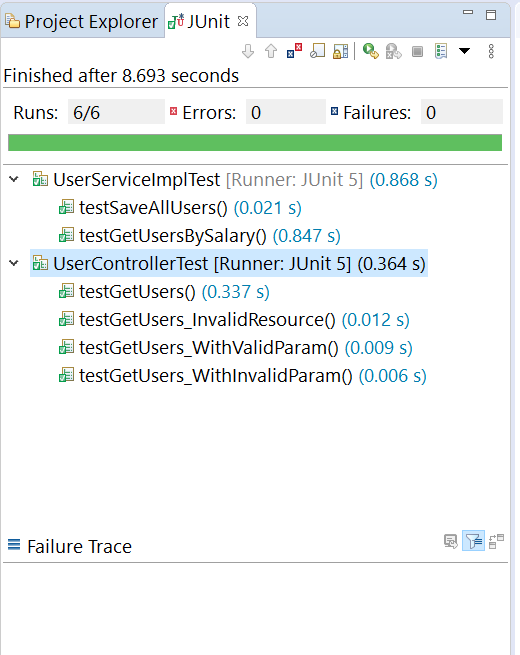

# Coding Challenge
## Citizen Disbursement System (CDS)
Develop a web application with one endpoint, eg, GET http://localhost:8080/users

### Acceptance criteria
1. Read a csv file, and insert into the database - You may include any data in the csv file
2. Expose /users endpoint that returns users with valid salary (0 <= salary <= 4000)

## Running application locally
Get the source code from GitHub using the following command.
```
git clone https://github.com/Hegderd/cds-repo.git
```
Prerequisite: Java 8 or above be installed on the computer to execute the following command.

### Run with maven command line
```
cd cds-repo/cds
mvnw spring-boot:run
```

Alternatively, source code can be imported to any Java IDE and executed as Spring Boot application.

## System Design and Usage
1. Application uses H2 in-memory database. No configuration is required to run the application.
2. On starting the application, system loads csv users data file located in the folder *src/main/resources/userDataFile.csv*
3. Currently, system provides one API endpoint (with optional parameter of salary) to retrieve a list of users 

Returns a list of all users : <br />
GET http://localhost:8080/users

With parameter of salary, for example, *salary=7680*, returns a list of users in the salary range *0 =< salary <= 7680* : <br />
GET http://localhost:8080/users?salary=7680

Returned users list is a JSON array in the following format :

```json
[
    {
        "name": "Laura Smith",
        "salary": 3400.0,
        "email": "laura@test.com"
    },
    {
        "name": "Quin Chong",
        "salary": 4081.0,
        "email": "quin@test.com"
    },
    {
        "name": "Rakesh Sawant",
        "salary": 4954.4,
        "email": "rakesh@test.com"
    },
    {
        "name": "Arlene Yabut",
        "salary": 5241.4,
        "email": "arlene@test.com"
    },
    {
        "name": "Jamie Johnson",
        "salary": 6450.5,
        "email": "jamie@test.com"
    },
    {
        "name": "Craig Booker",
        "salary": 7300.0,
        "email": "carig@test.com"
    },
    {
        "name": "Rachel Raymond",
        "salary": 7680.0,
        "email": "rachel@test.com"
    }
]
```

4. When no records are found for a particular query, system returns an empty JSON array as follows :
```json
[]
```

5. When errors are encountered, system returns a JSON error message as follows :

```json
{
    "status": "FAILED",
    "statusCode": "err-002",
    "message": "Resource not found",
    "uri": "/users1"
}
```

## Test execution result

